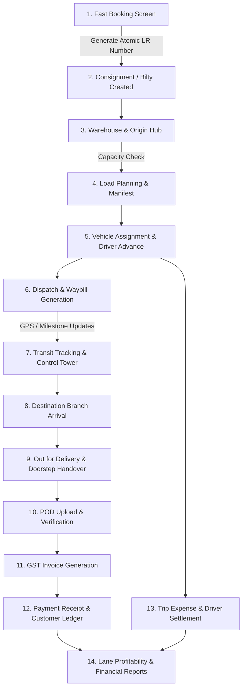

# TransporterTMS — Commercial Multi-Tenant Transport & Logistics Operating SaaS

[]()
[]()
[]()
[]()

> **Positioning:** *"All-in-One Transport Management & Logistics Operating Platform"*  
> Built for transporters, fleet owners, 3PL logistics providers, branch-based freight operators, and traditional transport companies migrating from paper Bilty/LR books, Excel sheets, and WhatsApp groups into an automated enterprise workflow.

---

## 📑 Table of Contents
1. [Product Overview](#-product-overview)
2. [Full Transporter Lifecycle](#-full-transporter-lifecycle)
3. [Core Technical Architecture](#-core-technical-architecture)
4. [Technology Stack](#-technology-stack)
5. [Demo Credentials & Seeded Roles](#-demo-credentials--seeded-roles)
6. [Quick Start & Local Setup](#-quick-start--local-setup)
7. [Docker Deployment](#-docker-deployment)
8. [Automated Verification Test Suite](#-automated-verification-test-suite)
9. [REST API Directory](#-rest-api-directory)
10. [Frontend Route Matrix](#-frontend-route-matrix)
11. [Master Architecture Documentation](#-master-architecture-documentation)

---

## 🚀 Product Overview

TransporterTMS is an enterprise-grade, multi-tenant SaaS application digitizing the traditional Indian road freight industry. It solves the fragmentation between paper bilty books, manual dispatch manifests, separate driver advance registers, delayed POD collections, and delayed customer invoicing.

### Key Capabilities
- **Fast Digital Bilty Booking:** High-speed keyboard-friendly booking interface with instant auto-calculation of freight, handling, hamali, loading/unloading, door delivery, GST/TDS, and Barcode/QR generation.
- **Dynamic Document Terminology:** Seamless global toggle between **Bilty**, **LR (Lorry Receipt)**, **GR (Goods Receipt)**, **Docket**, and **Consignment Note** across all screens, tables, and print templates.
- **Unified 10-Tab LR Record:** A single 360° screen containing Details, Route, Cargo, Charges, Vehicle & Trip, Timeline, POD, Invoice & Payments, Claims, and Immutable Audit Logs.
- **Visual Load Planning & Dispatch:** Intelligent vehicle capacity utilization bars (Weight & Volume) with bulk consignment assignment and stamped Dispatch Manifests.
- **Trip Settlement & Driver Advances:** Comprehensive trip ledger tracking diesel slips, Fastag tolls, driver cash advances, border transit allowances, and net settlement calculation.
- **Digital Proof of Delivery (POD):** Camera scan upload, receiver signature capture, shortage/damage remarks, and audit verification before billing.
- **GST Invoicing & Party Ledger:** Consolidated Bilty invoicing, automatic debit/credit party ledger tracking, partial payment receipts, and outstanding aging analysis.
- **Control Tower & Action Center:** Real-time delay detector, pending POD alerts, overdue receivables notifications, and 24x7 lane movement monitoring.
- **Mobile-First Driver PWA:** Big-touch mobile UI for drivers to check assigned trips, update transit checkpoints, upload delivery PODs offline, and log fuel expenses.
- **SaaS Super Admin Console:** Global platform dashboard tracking recurring MRR/ARR, tenant subscriptions, license quotas, and branch usage.

---

## 🔄 Full Transporter Lifecycle



---

## 🏛 Core Technical Architecture

### 1. Multi-Tenant Row-Level Data Isolation
Every operational table includes `tenant_id` and `organization_id`. Database queries through Sequelize services automatically inject tenant context extracted from verified JWT tokens, preventing cross-tenant data leaks.

### 2. Concurrency-Safe Sequential Number Generation
LR numbers, Invoices, Trips, and Dispatches are generated using atomic database locking:
```sql
SELECT next_number, prefix, fiscal_year, padding_digits 
FROM number_sequences 
WHERE tenant_id = ? AND branch_id = ? AND document_type = ? 
FOR UPDATE;
```
This guarantees zero gaps and zero duplicates even under concurrent booking requests across multiple branch counters.

### 3. Zero-Floating-Point Financial Arithmetic
All financial computations use exact integer paisa scaling (`Math.round(val * 100)`) and database `DECIMAL(12,2)` columns. This eliminates JavaScript IEEE-754 floating-point inaccuracies (such as `0.1 + 0.2 === 0.30000000000000004`).

### 4. Single-Use Refresh Token Rotation with Collision-Safe Hashing
Refresh tokens are hashed using SHA-256 with unique cryptographic UUIDs (`jti`), completely avoiding Bcrypt's 72-byte truncation boundary. Used tokens are immediately revoked; any replay attempt triggers an automatic session termination security alert.

---

## 💻 Technology Stack

| Layer | Technologies | Key Packages |
|---|---|---|
| **Backend API** | Node.js (v24), Express.js | `express`, `sequelize`, `mysql2`, `jsonwebtoken`, `bcryptjs`, `cors`, `dotenv` |
| **Database** | MySQL 8.0 | InnoDB, UTF8mb4, Row-level locking, B-tree indexes |
| **Frontend Web** | Next.js 14 (App Router), React 18, JavaScript | `tailwindcss`, `lucide-react`, `zustand`, `axios` |
| **Styling & Theme** | Vanilla CSS + Tailwind CSS | Background `#F6F8FB`, Sidebar `#111827`, Royal Blue `#2563EB` |
| **Containerization** | Docker, Docker Compose | Multi-stage Node Alpine images |

---

## 🔑 Demo Credentials & Seeded Roles

The database is pre-seeded with a comprehensive live enterprise dataset for **ABC Roadways Pvt Ltd** (4 Branches, 30 Customers, 20 Vehicles, 8 Drivers, 105 Consignments, 10 Trips, Dispatches, Invoices, and Ledgers).

All passwords are: **`Password@123`**

| Role | Email | Branch / Scope | Key Capabilities |
|---|---|---|---|
| **Super Admin** | `admin@transporter.io` | SaaS Platform Global | MRR, ARR, Tenants, Subscriptions, Platform Metrics |
| **Transport Owner** | `owner@abcroadways.com` | ABC Roadways (All Branches) | Full executive control, Financials, Branch Analytics |
| **Delhi Branch Manager** | `delhi.manager@abcroadways.com` | Delhi Head Office (`DEL`) | Delhi dispatch, Local load planning, Branch staff |
| **Mumbai Branch Manager** | `mumbai.manager@abcroadways.com` | Mumbai Port Branch (`BOM`) | Mumbai deliveries, Godown stock, Local invoicing |
| **Booking Clerk** | `booking.delhi@abcroadways.com` | Delhi Booking Counter | Fast Bilty generation, Barcode printing, Rate lookup |
| **Accountant** | `accountant@abcroadways.com` | Corporate Finance | GST Invoices, Payment entries, Driver settlements |

---

## ⚡ Quick Start & Local Setup

### Prerequisites
- Node.js (v18.0.0 or higher)
- MySQL Server (v8.0 or higher) running on `localhost:3306`

### 1. Clone & Setup Database
```bash
git clone https://github.com/your-org/transporter-saas.git
cd transporter-saas

# Ensure MySQL has database created:
mysql -u root -p -e "CREATE DATABASE IF NOT EXISTS transporter_saas_db CHARACTER SET utf8mb4 COLLATE utf8mb4_unicode_ci;"
```

### 2. Configure Backend
```bash
cd backend
npm install

# Verify .env configuration:
# DB_HOST=localhost
# DB_PORT=3306
# DB_USER=root
# DB_PASSWORD=your_mysql_password
# DB_NAME=transporter_saas_db
# PORT=5000

# Seed complete enterprise database:
npm run seed

# Run backend test suite:
npm test

# Start backend server:
npm start
# -> Backend running at http://localhost:5000
```

### 3. Configure Frontend
```bash
cd ../frontend
npm install

# Verify .env.local:
# NEXT_PUBLIC_API_URL=http://localhost:5000/api/v1

# Run Next.js:
npm run dev
# -> Frontend running at http://localhost:3000
```

---

## 🐳 Docker Deployment

The application includes production-ready Dockerfiles and `docker-compose.yml`.

To launch the complete stack with MySQL in one command:
```bash
docker compose up -d --build
```

Services exposed:
- **Frontend Web UI:** `http://localhost:3000`
- **Backend API:** `http://localhost:5000`
- **MySQL Database:** `localhost:3306`

---

## 🧪 Automated Verification Test Suite

Run the automated integration suite testing core system guarantees:
```bash
cd backend
npm test
```

### Test Assertions:
1. **Financial Precision:** Verified exact decimal addition, subtraction, and multi-term multiplication with zero floating-point error (`0.1 + 0.2 === 0.3`).
2. **Atomic Concurrency Number Generation:** Verified sequential generation of distinct consecutive numbers under parallel transactions (`DEL/26-27/000101` → `DEL/26-27/000102`).
3. **Multi-Tenant Row-Level Isolation:** Verified Tenant B cannot access or view any consignments or customer master records belonging to Tenant A.
4. **Single-Use Refresh Token Rotation:** Verified token rotation issuing new key pairs and instant rejection upon any replay attempt.

---

## 📡 REST API Directory

Base URL: `http://localhost:5000/api/v1`

### Authentication (`/auth`)
- `POST /auth/login` — Authenticate and receive JWT access & refresh tokens
- `POST /auth/refresh` — Single-use refresh token rotation
- `POST /auth/logout` — Revoke active refresh token
- `GET /auth/me` — Get current user session profile & permissions

### Dashboards & Analytics (`/dashboard`)
- `GET /dashboard/owner` — Owner executive KPIs, revenue, branch comparisons, Action Center alerts
- `GET /dashboard/super-admin` — SaaS platform metrics, MRR, ARR, active tenant subscriptions

### Bookings & Consignments (`/bookings`)
- `GET /bookings` — Paginated consignment register with filters (branch, status, date, search)
- `POST /bookings` — Fast Bilty booking with atomic number sequence generation
- `GET /bookings/:id` — Unified 10-tab LR record detail (cargo, route, charges, timeline, POD, audit)

### Public Shipment Tracking (`/tracking`)
- `GET /tracking?lr=DEL/26-27/000001` — Public tracking endpoint (no auth required)
- `GET /tracking/*` — Slash-safe LR number path parameter tracking

### Load Planning & Trips (`/load-planning`, `/trips`)
- `GET /load-planning/available` — Consignments ready for dispatch
- `POST /load-planning/dispatch` — Assign vehicle, driver advance, and generate dispatch manifest
- `GET /trips` — Trip register with status, route, and profitability
- `POST /trips/:id/settlement` — Settle driver expenses, diesel slips, and net balance

### Deliveries & Proof of Delivery (`/deliveries`, `/pods`)
- `GET /deliveries` — Destination branch arrival and out-for-delivery management
- `POST /deliveries/handover` — Doorstep delivery sign-off
- `GET /pods` — POD audit register
- `POST /pods/:id/verify` — Verify uploaded POD document

### Invoicing & Billing (`/billing`)
- `GET /billing/invoices` — Customer GST invoices list
- `POST /billing/invoices` — Generate consolidated invoice from delivered Bilties
- `POST /billing/payments` — Record customer payment receipt and update ledger
- `GET /billing/ledgers/:customerId` — Customer debit/credit statement of accounts

### Operating Expenses (`/expenses`)
- `GET /expenses` — Expense ledger (fuel, maintenance, toll, hamali, branch rent)
- `POST /expenses` — Record operational expense entry

### Masters & Fleet (`/customers`, `/fleet`, `/organizations`)
- `GET /customers` — Customer directory with GSTIN, PAN, and balance
- `POST /customers` — Create customer master
- `GET /fleet/vehicles` — Vehicle fleet list with fitness, permit, and insurance expiry
- `GET /fleet/drivers` — Driver roster with license verification
- `PATCH /organizations/terminology` — Toggle document terminology (Bilty, LR, GR, Docket)

---

## 🖥 Frontend Route Matrix

| Route | View Name | Description |
|---|---|---|
| `/` | **Landing Page** | Product pillars, feature showcase, and instant tracking search bar |
| `/track` | **Shipment Tracking** | Public milestone tracking portal with interactive timeline |
| `/login` | **Authentication** | Multi-tenant login with one-click demo role selectors |
| `/dashboard` | **Owner Dashboard** | Executive KPIs, branch comparison matrix, Action Center alerts |
| `/bookings` | **Consignment Register** | Searchable table of all Bilties with branch and status filters |
| `/bookings/new` | **Digital Bilty Book** | Rapid booking form with live rate and GST auto-calculator |
| `/bookings/[id]` | **10-Tab LR Record** | Complete 360° consignment file with printable Bilty template |
| `/load-planning` | **Load Planner** | Vehicle capacity utilization gauge and dispatch staging |
| `/trips` | **Trips Register** | Vehicle journeys, en-route milestones, and driver advance settlement |
| `/dispatches` | **Dispatch Challans** | Outbound vehicle manifests and driver gate passes |
| `/deliveries` | **Delivery Register** | Branch arrivals, godown unloading, and out-for-delivery handover |
| `/pods` | **POD Portal** | POD document verification, receiver signature audit |
| `/billing/invoices` | **Invoicing & Ledgers** | GST invoice generation, payment receipts, customer ledger sync |
| `/expenses` | **Expense Manager** | Trip fuel logs, maintenance entries, and branch operational costs |
| `/customers` | **Customer Master** | Consignor/consignee directory with ledger balances and credit limits |
| `/control-tower` | **Control Tower** | 24x7 lane movement monitor and delay early-warning system |
| `/reports` | **Reports & Analytics** | Freight registers, branch performance, and CSV exports |
| `/settings` | **Organization Settings** | Dynamic terminology toggle (Bilty, LR, GR, Docket) |
| `/driver/dashboard` | **Driver Mobile PWA** | Big-touch driver portal for trip actions, POD scans, and diesel logs |
| `/super-admin/dashboard` | **SaaS Admin Console** | Platform-level MRR, active organizations, and license provisioning |

---

## 📖 Master Architecture Documentation

For complete architectural specifications, database entity relationship diagrams, state machine flows, and financial calculation formulas, refer to the master architecture document:
👉 [docs/TRANSPORT_SAAS_ARCHITECTURE_MASTER.md](docs/TRANSPORT_SAAS_ARCHITECTURE_MASTER.md)

---

© 2026 TransporterTMS. All rights reserved. Built for Commercial Logistics Operations.
