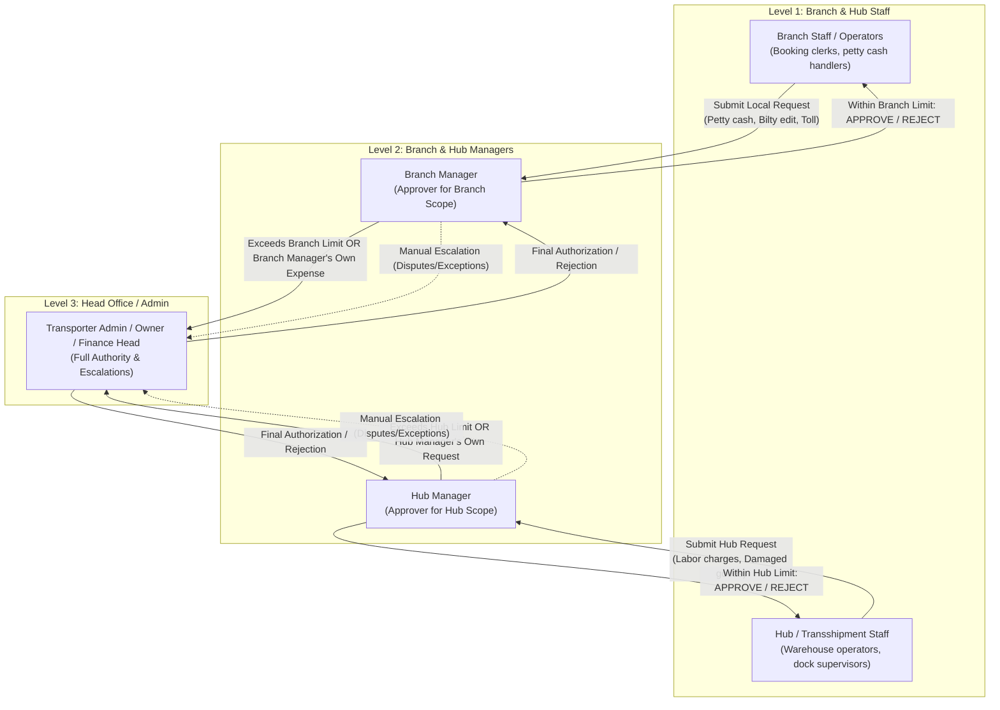

# HIERARCHICAL APPROVALS & WORKFLOW MANAGEMENT ARCHITECTURE
## Dedicated Approval Engine for Multi-Branch & Hub Logistics Operations

**Document Version:** 1.0.0  
**Target Module:** Transporter Approvals Center (`/approvals`)  
**Scope:** Multi-Branch, Multi-Hub, Hierarchical Routing, Financial & Operational Controls  

---

## 1. EXECUTIVE SUMMARY & OBJECTIVE

In road transportation, logistics, and fleet operations, business operations are distributed across multiple physical **Branches**, **Transshipment Hubs**, and the **Head Office (Admin)**. 

Uncontrolled financial disbursements, unapproved consignment cancellations, unauthorized freight rate discounts, or untracked driver advances can lead to severe revenue leakages.

This system introduces a **Centralized, Hierarchical Approval Workflow Engine**:
1. **Branch Staff / Operators** submit operational and financial requests $\rightarrow$ Routed directly to their designated **Branch Manager**.
2. **Hub Staff / Warehouse Operators** submit transshipment/handling requests $\rightarrow$ Routed directly to their **Hub Manager**.
3. **Branch Managers & Hub Managers** approve local requests within their delegated financial/operational authority.
4. **High-Value Requests, Escalations, or Manager Claims** $\rightarrow$ Automatically routed to the **Transporter Admin / Head Office** for final authorization.

---

## 2. HIERARCHICAL APPROVAL ROUTING MATRIX

### 2.1 Visual Workflow Hierarchy



### 2.2 Routing Logic Rules

| Requester Role | Request Nature | Routed To (Reviewer) | Escalation Condition |
| :--- | :--- | :--- | :--- |
| **Branch Staff** (Clerk, Dispatcher) | Petty Cash, Local Expense $\le$ ₹5,000 | **Branch Manager** of requester's branch | If amount > ₹5,000 $\rightarrow$ Routes to **Admin** |
| **Branch Staff** | Bilty / Consignment Cancellation | **Branch Manager** | If consignment already dispatched $\rightarrow$ **Admin** |
| **Branch Staff** | Freight Rate Discount $\le$ 10% | **Branch Manager** | If discount > 10% $\rightarrow$ **Admin** |
| **Hub Staff** | Unloading / Coolie Extra Charges | **Hub Manager** of requester's hub | If amount > ₹10,000 $\rightarrow$ **Admin** |
| **Branch Manager** | Branch Monthly Petty Cash / Utility Bill | **Transporter Admin** | Direct Head Office routing |
| **Hub Manager** | Equipment Repair / Warehouse Maintenance | **Transporter Admin** | Direct Head Office routing |
| **Fleet / Driver** | En-Route Breakdown / Emergency Tyre Repair | **Hub Manager** or **Admin** | If > ₹15,000 $\rightarrow$ **Admin** |

---

## 3. CORE OPERATIONAL REQUEST CATEGORIES

```text
┌────────────────────────────────────────────────────────────────────────┐
│                        APPROVAL REQUEST DOMAINS                        │
├──────────────────────────────────┬─────────────────────────────────────┤
│ 1. FINANCIAL & CASH CLAIMS       │ 2. DOCKET & BILLING GOVERNANCE      │
│ • Local branch petty cash        │ • Consignment / Bilty cancellation  │
│ • Loading / Unloading hamali     │ • Freight discount override         │
│ • Fuel slip extra claims         │ • Customer credit limit override    │
│ • Driver trip en-route advance   │ • Bad debt / invoice deduction      │
├──────────────────────────────────┼─────────────────────────────────────┤
│ 3. TRIP & FLEET DISPATCH         │ 4. DAMAGE & CLAIMS MANAGEMENT       │
│ • Overweight / Overload dispatch │ • Goods in-transit damage claim     │
│ • Route deviation authorization  │ • Short delivery compensation       │
│ • Trip settlement discrepancy    │ • Accident insurance claim filing   │
└──────────────────────────────────┴─────────────────────────────────────┘
```

---

## 4. DATABASE ARCHITECTURE (TENANT-ISOLATED SCHEMA)

Every transporter has an isolated MySQL tenant database (`req.tenantDb`). The approvals engine is backed by the `approval_requests` and `approval_audit_logs` tables.

### 4.1 Table: `approval_requests`

```sql
CREATE TABLE `approval_requests` (
  `id` VARCHAR(36) PRIMARY KEY,
  `tenant_id` VARCHAR(36) NOT NULL,
  `organization_id` VARCHAR(36) NOT NULL,
  `branch_id` VARCHAR(36) NOT NULL COMMENT 'Branch or Hub where request originated',
  
  -- Request Type & Linkage
  `request_type` ENUM(
    'EXPENSE_CLAIM',
    'BOOKING_CANCELLATION',
    'RATE_DISCOUNT',
    'DRIVER_ADVANCE',
    'TRIP_SETTLEMENT',
    'VEHICLE_MAINTENANCE',
    'CREDIT_OVERRIDE',
    'DAMAGE_CLAIM',
    'OTHER'
  ) NOT NULL,
  `reference_id` VARCHAR(36) NULL COMMENT 'UUID of Expense, Consignment, Trip, etc.',
  `reference_code` VARCHAR(50) NULL COMMENT 'Display code: LR-10492, EXP-902, TRP-8812',
  `amount` DECIMAL(12,2) DEFAULT 0.00,
  
  -- Requester & Routing
  `requester_id` VARCHAR(36) NOT NULL,
  `approval_level` ENUM('BRANCH_MANAGER', 'HUB_MANAGER', 'ADMIN') NOT NULL DEFAULT 'BRANCH_MANAGER',
  `assigned_user_id` VARCHAR(36) NULL COMMENT 'Explicit user if assigned specifically',
  
  -- Workflow Status
  `status` ENUM('PENDING', 'APPROVED', 'REJECTED', 'ESCALATED', 'CANCELLED') NOT NULL DEFAULT 'PENDING',
  `priority` ENUM('LOW', 'NORMAL', 'HIGH', 'URGENT') NOT NULL DEFAULT 'NORMAL',
  
  -- Outcome details
  `reviewer_id` VARCHAR(36) NULL,
  `reviewed_at` DATETIME NULL,
  `requester_notes` TEXT NULL,
  `reviewer_comments` TEXT NULL,
  `supporting_document_url` VARCHAR(500) NULL COMMENT 'Receipt, bill voucher, or photo',
  `meta_data` JSON NULL COMMENT 'Snapshot of items, amounts, or discrepancy delta',
  
  `created_at` DATETIME NOT NULL DEFAULT CURRENT_TIMESTAMP,
  `updated_at` DATETIME NOT NULL DEFAULT CURRENT_TIMESTAMP ON UPDATE CURRENT_TIMESTAMP,
  
  INDEX idx_tenant_branch (`tenant_id`, `branch_id`),
  INDEX idx_status_level (`status`, `approval_level`),
  INDEX idx_requester (`requester_id`)
) ENGINE=InnoDB DEFAULT CHARSET=utf8mb4 COLLATE=utf8mb4_unicode_ci;
```

### 4.2 Table: `approval_audit_logs` (Audit Trail)

```sql
CREATE TABLE `approval_audit_logs` (
  `id` VARCHAR(36) PRIMARY KEY,
  `approval_request_id` VARCHAR(36) NOT NULL,
  `action` ENUM('SUBMITTED', 'FORWARDED', 'ESCALATED', 'APPROVED', 'REJECTED', 'COMMENTED') NOT NULL,
  `actor_id` VARCHAR(36) NOT NULL COMMENT 'User who performed the action',
  `actor_role` VARCHAR(50) NOT NULL,
  `comments` TEXT NULL,
  `created_at` DATETIME NOT NULL DEFAULT CURRENT_TIMESTAMP,
  
  INDEX idx_approval_log (`approval_request_id`)
) ENGINE=InnoDB DEFAULT CHARSET=utf8mb4 COLLATE=utf8mb4_unicode_ci;
```

---

## 5. API SPECIFICATION & WORKFLOW ENGINE

### 5.1 Endpoints

| Method | Endpoint | Description | Access Level |
| :--- | :--- | :--- | :--- |
| `GET` | `/api/v1/approvals` | Fetch approval list (with `tab=inbox\|outbox\|branch\|all`) | Authenticated Users |
| `GET` | `/api/v1/approvals/badge-counts` | Pending request counts for sidebar notification badge | Authenticated Users |
| `GET` | `/api/v1/approvals/:id` | Full detail of a request including audit trail | Authorized Approver / Requester |
| `POST` | `/api/v1/approvals` | Create and auto-route a new approval request | Authenticated Users |
| `PATCH` | `/api/v1/approvals/:id/action` | Perform action (`APPROVE`, `REJECT`, `ESCALATE`) | Authorized Approver |

---

### 5.2 Action Request Payload & Side Effects

#### Payload:
```json
{
  "action": "APPROVE", 
  "reviewer_comments": "Verified fuel bill and vehicle odometer. Approved for disbursement."
}
```
*(For `REJECT`, `reviewer_comments` is strictly mandatory).*

#### Side-Effect Engine:
When an approval request reaches terminal status (`APPROVED` or `REJECTED`), the system executes automated side effects:
- **`EXPENSE_CLAIM` $\rightarrow$ `APPROVED`**: Sets `expenses.is_approved = true`, `approved_by = req.user.id`, and creates a journal debit entry in the branch cash ledger.
- **`BOOKING_CANCELLATION` $\rightarrow$ `APPROVED`**: Updates `consignments.status = 'CANCELLED'` and reverts allocated vehicle capacity.
- **`DRIVER_ADVANCE` $\rightarrow$ `APPROVED`**: Disburses the driver cash advance and updates `driver_advances.status = 'DISBURSED'`.
- **`TRIP_SETTLEMENT` $\rightarrow$ `APPROVED`**: Settles final trip balance and flags `trips.settlement_status = 'SETTLED'`.

---

## 6. FRONTEND UI ARCHITECTURE (`/approvals`)

### 6.1 Screen Layout & Information Hierarchy

```text
┌────────────────────────────────────────────────────────────────────────────────────────┐
│  Approvals & Workflow Center                                 [+ Create Request]        │
│  Manage financial authorizations, consignment cancellations & operational escalations  │
├───────────────────┬───────────────────┬───────────────────┬────────────────────────────┤
│  ⚡ Pending Action │  ✅ Approved Week  │  ❌ Rejected      │  🔺 Escalated to Admin     │
│       4 Requests  │       18 Requests │       2 Requests  │        1 Request           │
├───────────────────┴───────────────────┴───────────────────┴────────────────────────────┤
│ [ Needs My Action (4) ]   [ My Requests (Outbox) ]   [ Branch Activity ]   [ Audit Log ]│
├────────────────────────────────────────────────────────────────────────────────────────┤
│ Filter: [All Types ▼] [All Branches ▼] [Priority ▼]                      [Search LR/Exp]│
├────────────────────────────────────────────────────────────────────────────────────────┤
│ Request Ref   Type               Requester        Branch       Amount    Date   Actions│
├────────────────────────────────────────────────────────────────────────────────────────┤
│ EXP-2024-88   Petty Cash (Coolie) Ramesh (Staff)  Nagpur Hub   ₹3,500   Today  [Review]│
│ LR-991204     Bilty Cancel        Sunil (Clerk)   Pune Branch  --       Today  [Review]│
│ ADV-1029      Driver Advance      Dinesh (Driver) Mumbai Main  ₹5,000   Oct 06 [Review]│
│ MNT-3011      Tyre Repair         Vikram (BM)     Indore Hub   ₹18,500  Oct 05 [Review]│
└────────────────────────────────────────────────────────────────────────────────────────┘
```

### 6.2 Review & Decision Drawer (Modal)

When clicking **[Review]**, an interactive slide-over drawer opens:
1. **Request Metadata Header**: Reference ID, Requester name, Branch name, timestamp, and priority badge.
2. **Context Snapshot**: Detailed item breakdown, original docket/trip card, and attached receipt preview with full-size zoom.
3. **Audit History Timeline**:
   - `09:15 AM` - Submitted by Ramesh (Nagpur Hub Staff)
   - `10:30 AM` - Reviewed by Branch Manager Suresh $\rightarrow$ *"Forwarded with recommendation"*
4. **Action Buttons**:
   - **Approve (Green)**: Instant approval with confirmation prompt.
   - **Reject (Red)**: Opens remark input before submitting rejection.
   - **Escalate to Head Office (Purple)**: Allows Branch Manager to attach notes and escalate to Admin.

---

## 7. ROLE-BASED ACCESS CONTROL (RBAC) MAPPING

| User Role | View Scope | Can Approve | Can Escalate | Can Create Requests |
| :--- | :--- | :--- | :--- | :--- |
| **Transporter Admin / Owner** | **All Branches & Hubs** (Company-wide) | Everything (Final authority) | N/A (Top level) | Yes |
| **Branch Manager** | **Assigned Branch** | Staff requests $\le$ Branch limit | Yes (to Admin) | Yes (to Admin) |
| **Hub Manager** | **Assigned Hub** | Hub staff requests $\le$ Hub limit | Yes (to Admin) | Yes (to Admin) |
| **Branch / Hub Staff** | **Only their own submissions** | No | No | Yes (to Branch Manager) |

---

## 8. INTEGRATION WITH SIDEBAR & REAL-TIME BADGES

1. **Sidebar Link**:
   - Route: `/approvals`
   - Icon: `CheckCircle2` / `ShieldCheck`
   - Visible to all roles, but content dynamically scoped.
2. **Dynamic Live Badge**:
   - Shows real-time pending count:
     - Admin sees count of **all pending Admin-level requests**.
     - Branch Manager sees count of **all pending requests in their branch**.
     - Staff sees count of **their rejected or completed updates**.

---

## 9. FUTURE EXTENSIBILITY & AUTOMATION HOOKS

1. **Rule-Based Auto-Approvals**:
   - Auto-approve Fastag toll expenses if matched against the FASTag API statement.
   - Auto-approve fuel expenses if odometer GPS distance matches fuel quantity within 5% tolerance.
2. **Instant Mobile Approvals via WhatsApp**:
   - Interactive WhatsApp messages sent to Branch Managers/Admins with `[Approve]` and `[Reject]` action buttons for urgent en-route driver requests.
3. **Escalation SLA Timers**:
   - If a request is not reviewed by the Branch Manager within 4 business hours, it automatically alerts or escalates to the Transporter Admin.
