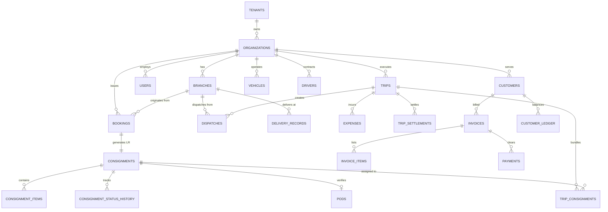

# MASTER DEVELOPMENT & ARCHITECTURE BLUEPRINT
# Commercial Multi-Tenant Transport Management & Logistics Operating Platform

**Product Positioning:** "All-in-One Transport Management & Logistics Operating Platform"  
**Target Audience:** Transporters, road freight operators, logistics companies, fleet operators, branch-based transport enterprises.  
**Tech Stack:**
- **Backend:** Node.js, Express.js, Sequelize ORM (MVC & Functional Service-Repository Approach), MySQL, Redis & BullMQ.
- **Frontend:** Next.js (App Router), React, JavaScript (No TypeScript), Tailwind CSS, Lucide React, TanStack Query, React Hook Form, Recharts, Zustand.

---

## 1. PROJECT DIRECTORY STRUCTURE (MONOREPO)

```text
transport-saas/
│
├── frontend/
│   ├── app/
│   │   ├── (auth)/
│   │   │   ├── login/page.js
│   │   │   ├── forgot-password/page.js
│   │   │   └── reset-password/page.js
│   │   ├── (super-admin)/
│   │   │   ├── dashboard/page.js
│   │   │   ├── organizations/page.js
│   │   │   ├── subscriptions/page.js
│   │   │   └── plans/page.js
│   │   ├── (owner)/
│   │   │   ├── dashboard/page.js
│   │   │   ├── approvals/page.js
│   │   │   ├── action-center/page.js
│   │   │   ├── bookings/
│   │   │   │   ├── page.js
│   │   │   │   ├── new/page.js
│   │   │   │   └── [id]/page.js
│   │   │   ├── dispatches/page.js
│   │   │   ├── trips/
│   │   │   │   ├── page.js
│   │   │   │   ├── new/page.js
│   │   │   │   └── [id]/page.js
│   │   │   ├── load-planning/page.js
│   │   │   ├── warehouse/page.js
│   │   │   ├── deliveries/page.js
│   │   │   ├── pods/page.js
│   │   │   ├── control-tower/page.js
│   │   │   ├── billing/
│   │   │   │   ├── invoices/page.js
│   │   │   │   ├── payments/page.js
│   │   │   │   └── ledger/page.js
│   │   │   ├── expenses/
│   │   │   │   ├── page.js
│   │   │   │   └── settlements/page.js
│   │   │   ├── fleet/
│   │   │   │   ├── vehicles/page.js
│   │   │   │   ├── drivers/page.js
│   │   │   │   ├── maintenance/page.js
│   │   │   │   └── fuel/page.js
│   │   │   ├── customers/page.js
│   │   │   ├── reports/page.js
│   │   │   └── settings/
│   │   │       ├── organization/page.js
│   │   │       ├── branches/page.js
│   │   │       └── roles/page.js
│   │   ├── (driver)/
│   │   │   ├── dashboard/page.js
│   │   │   ├── trip/page.js
│   │   │   └── pod-upload/page.js
│   │   ├── (customer)/
│   │   │   ├── dashboard/page.js
│   │   │   ├── consignments/page.js
│   │   │   ├── invoices/page.js
│   │   │   └── pods/page.js
│   │   ├── track/
│   │   │   └── page.js
│   │   ├── layout.js
│   │   └── page.js
│   ├── components/
│   │   ├── ui/
│   │   ├── layout/
│   │   ├── forms/
│   │   ├── tables/
│   │   ├── charts/
│   │   ├── dashboard/
│   │   ├── tracking/
│   │   └── documents/
│   ├── hooks/
│   ├── lib/
│   ├── services/
│   ├── store/
│   ├── utils/
│   └── styles/
│
├── backend/
│   ├── src/
│   │   ├── config/
│   │   │   ├── database.js
│   │   │   ├── redis.js
│   │   │   ├── constants.js
│   │   │   └── env.js
│   │   ├── models/
│   │   ├── repositories/
│   │   ├── services/
│   │   ├── controllers/
│   │   ├── middleware/
│   │   ├── validators/
│   │   ├── routes/
│   │   ├── utils/
│   │   └── jobs/
│   ├── database/
│   │   ├── migrations/
│   │   └── seeders/
│   ├── uploads/
│   ├── tests/
│   ├── app.js
│   └── server.js
│
├── docker-compose.yml
├── README.md
└── docs/
    └── TRANSPORT_SAAS_ARCHITECTURE_MASTER.md
```

---

## 2. HIGH-LEVEL ARCHITECTURE & DATA FLOW

```mermaid
flowchart TB
    subgraph ClientLayer [Client Applications - Next.js & Tailwind CSS]
        PublicTrack[Public Tracking Portal /track]
        OwnerApp[Transporter Web Console (Owner/Managers)]
        DriverPWA[Driver Mobile PWA (Offline Sync Ready)]
        CustomerPortal[Customer Self-Service Portal]
        SuperAdmin[SaaS Super-Admin Console]
    end

    subgraph Gateway [API Routing & Security Layer - Express.js]
        CORS[CORS / Helmet / RateLimiting]
        AuthMW[Authentication & Refresh JWT Rotation]
        TenantMW[Tenant & Subscription Resolver]
        BranchMW[Branch Isolation & RBAC Guard]
        AuditMW[Audit & Mutation Tracker]
    end

    subgraph ServiceLayer [Functional Business & Domain Services]
        NumSeq[Atomic Sequence Engine (FOR UPDATE)]
        BookingDomain[Booking & Bilty Management]
        TripDomain[Trip, Dispatch & Load Planning]
        DeliveryDomain[Destination Receipt & POD Verification]
        FinanceDomain[Invoicing, Ledger, Expenses & Settlements]
        FleetDomain[Fleet, Fuel, Maintenance & Profitability]
        AnalyticsDomain[Aggregated Control Tower & Daily Brief]
    end

    subgraph DataLayer [Storage & Persistence]
        MySQL[(MySQL 8.0 Engine via Sequelize ORM)]
        Redis[(Redis 7.0 - Cache, Tokens & BullMQ)]
        DocStorage[File Store: Local / AWS S3 / Cloudinary]
    end

    ClientLayer --> Gateway
    Gateway --> ServiceLayer
    ServiceLayer --> DataLayer
```

### Request Lifecycle
```text
HTTP Request
  → Rate Limiter / Helmet / CORS
  → Authenticate Middleware (JWT Bearer Token / HTTP-only Cookie)
  → Tenant Resolver Middleware (Binds tenant_id, organization_id)
  → Branch Scoping & Subscription Guard (Quota checks)
  → RBAC Authorize Middleware (e.g. 'booking.create')
  → Request Validator (Joi/Zod)
  → Controller (Extracts inputs, invokes service)
  → Domain Service (Core business rules, calculations, events)
  → Repository (Sequelize queries with tenant isolation)
  → MySQL (Transactional atomic writes)
  → Standard JSON Response { success, message, data, pagination }
```

---

## 3. DATABASE ENTITY RELATIONSHIP DESIGN (SEQUELIZE)



---

## 4. SEQUELIZE SCHEMA DEFINITION PLAN

The application uses **MySQL 8.0** with **Sequelize ORM**. Every table uses UUID primary keys, explicit tenant/organization foreign keys, composite indexes, soft delete (`deleted_at`), and `DECIMAL(12,2)` precision for all currency fields.

### Key Models & Attributes

1. **`Tenant`**: `id`, `name`, `status (ACTIVE, TRIAL, SUSPENDED)`, `created_at`, `updated_at`.
2. **`Organization`**: `id`, `tenant_id`, `business_name`, `legal_name`, `gstin`, `pan`, `address`, `city`, `state`, `pincode`, `logo_url`, `currency (default INR)`, `document_terminology (BILTY, LR, GR, DOCKET, CONSIGNMENT_NOTE, CUSTOM)`, `settings (JSON)`.
3. **`Branch`**: `id`, `tenant_id`, `organization_id`, `branch_code (e.g. DEL)`, `branch_name`, `address`, `city`, `state`, `phone`, `email`, `is_hub (BOOLEAN)`.
4. **`User`**: `id`, `tenant_id`, `organization_id`, `branch_id (nullable for owners)`, `first_name`, `last_name`, `email`, `phone`, `password_hash`, `status`, `refresh_token_hash`.
5. **`Role` & `Permission`**: Roles (`SUPER_ADMIN`, `TRANSPORT_OWNER`, `BRANCH_MANAGER`, `BOOKING_OPERATOR`, `DISPATCH_OPERATOR`, `ACCOUNTANT`, `FLEET_MANAGER`, `DRIVER`, `CUSTOMER`), mapped via `RolePermission` and `UserRole`.
6. **`NumberSequence`**: Atomic counter: `tenant_id`, `organization_id`, `branch_id`, `document_type (BILTY, DISPATCH, TRIP, INVOICE)`, `financial_year`, `prefix`, `current_number`, `template (e.g. {BRANCH}/{FY}/{SEQ:6})`.
7. **`Customer`**: `id`, `tenant_id`, `organization_id`, `customer_code`, `name`, `gstin`, `pan`, `customer_type (CONSIGNOR, CONSIGNEE, BOTH)`, `credit_limit`, `credit_days`, `opening_balance`.
8. **`CustomerAddress`**: `id`, `customer_id`, `address_type (PICKUP, DELIVERY, BILLING)`, `address`, `city`, `state`, `pincode`.
9. **`RateContract`**: `id`, `tenant_id`, `organization_id`, `customer_id`, `origin_branch_id`, `dest_branch_id`, `rate_type (PER_KG, PER_TON, PER_PACKAGE, PER_VEHICLE, FIXED)`, `rate`, `min_freight`, `loading_charge`, `unloading_charge`, `door_delivery_charge`.
10. **`Booking` & `Consignment`**:
    - `lr_number`, `booking_date`, `origin_branch_id`, `dest_branch_id`, `consignor_id`, `consignee_id`.
    - `packages_count`, `package_type`, `actual_weight (KG)`, `charged_weight (KG)`.
    - `material_description`, `invoice_no`, `invoice_date`, `invoice_value`, `eway_bill_no`, `eway_bill_expiry`.
    - Financials: `rate`, `freight_amount`, `loading_charges`, `unloading_charges`, `door_delivery_charges`, `other_charges`, `tax_amount`, `discount_amount`, `total_amount`.
    - `payment_type (PAID, TO_PAY, TBB, CREDIT, FOC)`.
    - `status (BOOKED, MATERIAL_RECEIVED, READY_FOR_DISPATCH, LOADED, DISPATCHED, IN_TRANSIT, REACHED_DESTINATION, OUT_FOR_DELIVERY, DELIVERED, POD_PENDING, POD_UPLOADED, COMPLETED)`.
11. **`ConsignmentItem`**: Sub-items and package dimensions (`length`, `width`, `height`, `package_count`).
12. **`ConsignmentStatusHistory`**: Detailed audit trail: `consignment_id`, `status`, `location`, `branch_id`, `user_id`, `remarks`, `latitude`, `longitude`, `timestamp`.
13. **`Vehicle`**: `vehicle_number`, `vehicle_code`, `vehicle_type (TRUCK, MINI_TRUCK, TRAILER, CONTAINER, PICKUP, TEMPO)`, `ownership (OWN, ATTACHED, MARKET)`, `capacity_ton`, `rc_expiry`, `insurance_expiry`, `fitness_expiry`, `puc_expiry`, `status (AVAILABLE, ON_TRIP, MAINTENANCE, INACTIVE)`.
14. **`Driver`**: `driver_code`, `name`, `phone`, `license_number`, `license_expiry`, `assigned_vehicle_id`, `status`.
15. **`Trip`**: `trip_number`, `vehicle_id`, `driver_id`, `origin_branch_id`, `dest_branch_id`, `start_odometer`, `end_odometer`, `start_time`, `end_time`, `status (PLANNED, READY, RUNNING, COMPLETED, SETTLED)`.
16. **`TripConsignment`**: Many-to-many junction between `Trip` and `Consignment`.
17. **`Dispatch`**: `dispatch_number`, `trip_id`, `dispatch_date`, `seal_number`, `remarks`, `dispatch_challan_url`.
18. **`Warehouse` & `WarehouseMovement`**: Godown tracking by zone, rack, bay, floor; tracking status (`WAITING_DISPATCH`, `READY_LOADING`, `IN_HOLD`, `DESTINATION_RECEIPT`).
19. **`DeliveryRecord`**: `consignment_id`, `receiver_name`, `receiver_phone`, `delivery_date`, `otp_verified`, `signature_url`, `delivery_photo_url`, `remarks`.
20. **`Pod`**: `consignment_id`, `file_url`, `status (POD_PENDING, POD_UPLOADED, POD_VERIFIED, POD_SENT_TO_CUSTOMER)`, `verified_by`, `verified_at`.
21. **`Invoice`**: `invoice_number`, `customer_id`, `invoice_date`, `due_date`, `subtotal`, `cgst`, `sgst`, `igst`, `total_amount`, `status (DRAFT, GENERATED, PARTIAL, PAID, OVERDUE, CANCELLED)`.
22. **`CustomerLedger`**: Double-entry ledger: `customer_id`, `entry_date`, `reference_type (INVOICE, PAYMENT, CREDIT_NOTE, DEBIT_NOTE)`, `debit_amount`, `credit_amount`, `balance_amount`.
23. **`Expense`, `DriverAdvance`, `TripSettlement`**:
    - Trip expenses (`DIESEL`, `TOLL`, `DRIVER_ALLOWANCE`, `HAMALI`, `REPAIR`).
    - Driver advances and settlement balancing (`advance_given`, `expenses_reported`, `refund_or_payable`).
24. **`FuelEntry` & `VehicleMaintenance`**: Mileage tracking (`km_per_litre`, `cost_per_km`) and preventive maintenance schedule.
25. **`Claim`**: Cargo damage/shortage claim tracking.
26. **`AuditLog`**: Mutation logging (`user_id`, `action`, `entity_type`, `entity_id`, `old_values`, `new_values`, `ip_address`).
27. **`SaaSPlan` & `SaaSSubscription`**: Multi-tenant licensing (`STARTER`, `PROFESSIONAL`, `BUSINESS`, `ENTERPRISE`), quotas (`branch_limit`, `user_limit`, `booking_limit_monthly`).

---

## 5. MULTI-TENANT ISOLATION STRATEGY

1. **Shared Database with Row-Level Isolation**:
   - Every tenant table contains `tenant_id` and `organization_id`.
   - Indexed composite keys: `(tenant_id, organization_id, created_at)`.
2. **Tenant Resolver Middleware (`tenantResolver.js`)**:
   - Decodes JWT access token.
   - Attaches `req.tenant = { tenantId, organizationId, branchId, role, permissions }`.
3. **Repository Layer Enforcement**:
   - Every Sequelize repository query injects `where: { tenant_id: req.tenant.tenantId, organization_id: req.tenant.organizationId }`.
   - Zero raw SQL without explicit tenant parameter binding.
4. **Cross-Tenant Guard Tests**:
   - Automated integration tests ensuring Tenant A requests cannot access or mutate Tenant B records.

---

## 6. AUTHENTICATION & REFRESH ROTATION STRATEGY

1. **Access Tokens**: Short-lived (15 minutes), containing `{ userId, tenantId, organizationId, branchId, role }`.
2. **Refresh Tokens**: Long-lived (7 days), stored hashed (`bcrypt`) in MySQL `RefreshTokens` table.
3. **Refresh Rotation**: Every refresh request invalidates the previous refresh token and issues a new pair.
4. **Device Revocation**:
   - "Logout current device": Deletes single refresh token.
   - "Logout from all devices": Deletes all active refresh tokens for the `user_id`.

---

## 7. RBAC (ROLE-BASED ACCESS CONTROL) STRATEGY

- Standard roles: `SUPER_ADMIN`, `TRANSPORT_OWNER`, `ADMIN`, `BRANCH_MANAGER`, `BOOKING_OPERATOR`, `DISPATCH_OPERATOR`, `DELIVERY_OPERATOR`, `ACCOUNTANT`, `FLEET_MANAGER`, `DRIVER`, `CUSTOMER`.
- Granular permissions: `booking.view`, `booking.create`, `booking.update`, `dispatch.create`, `trip.manage`, `trip.settle`, `pod.upload`, `pod.verify`, `invoice.create`, `payment.create`, `expense.create`, `reports.view`, `branch.manage`.
- Backend guard middleware: `authorize(['booking.create'])`.
- Frontend `<Can permission="...">` and `usePermissions()` conditional rendering.

---

## 8. ATOMIC NUMBER-SEQUENCE STRATEGY

To prevent duplicate Bilty/LR or Invoice numbers during high concurrency:
1. Sequelize transactional row-level lock:
   ```javascript
   const sequence = await NumberSequence.findOne({
     where: { tenant_id, organization_id, branch_id, document_type, financial_year },
     lock: transaction.LOCK.UPDATE,
     transaction
   });
   ```
2. Increments `current_number` atomically inside the same transaction as the booking creation.
3. Customizable format templates: `{BRANCH}/{FY}/{SEQ:6}` resolving to `DEL/26-27/000124`.

---

## 9. FINANCIAL DATA PRECISION STRATEGY

1. MySQL stores all amounts in `DECIMAL(12,2)`.
2. Backend business logic calculations convert monetary amounts to integer paisa (multiplied by 100) or use precision decimal arithmetic to prevent JavaScript floating-point rounding errors (`0.1 + 0.2 !== 0.3`).
3. Running customer balance is updated transactionally with each ledger debit or credit entry.

---

## 10. API ARCHITECTURE (`/api/v1/`)

Unified REST standard:
- **Success:** `{ "success": true, "message": "...", "data": {} }`
- **Error:** `{ "success": false, "message": "...", "errors": [] }`
- **Paginated:** `{ "success": true, "data": [], "pagination": { "page": 1, "limit": 20, "total": 100, "pages": 5 } }`

### Endpoints
- `/api/v1/auth/`: login, refresh, logout, reset-password, me
- `/api/v1/saas/`: plans, organizations, subscriptions, metrics
- `/api/v1/organizations/`: profile, branches, settings, terminology
- `/api/v1/customers/`: CRUD, addresses, rate-contracts, ledger
- `/api/v1/bookings/`: CRUD, biltys, fast-booking, print-pdf
- `/api/v1/consignments/`: status updates, timeline, barcode
- `/api/v1/trips/`: load-plan, create, dispatch, complete, settle
- `/api/v1/deliveries/`: destination-receipt, out-for-delivery, mark-delivered
- `/api/v1/pods/`: upload, verify, bulk-upload
- `/api/v1/invoices/`: generate, list, payments, ageing
- `/api/v1/expenses/`: log, categories, driver-advance, settlements
- `/api/v1/fleet/`: vehicles, drivers, maintenance, fuel
- `/api/v1/reports/`: bookings, freight, outstanding, vehicle-profitability, route-profitability
- `/api/v1/dashboard/`: owner, branch, control-tower, daily-brief
- `/api/v1/tracking/`: public safe tracking by Bilty/LR number

---

## 11. FRONTEND ROUTE STRUCTURE & DESIGN SYSTEM

- Built with **Next.js (App Router)** and **Tailwind CSS**.
- **Aesthetic Palette:**
  - Background: `#F6F8FB`
  - Sidebar: `#111827`
  - Primary Accent: `#2563EB`
  - Delivered: `#16A34A`
  - In Transit: `#9333EA`
  - Warning/Pending: `#F59E0B`
  - Danger/Delayed: `#DC2626`
- **Dynamic Terminology:** Configurable context allowing the transporter to toggle labels between **Bilty**, **LR**, **GR**, **Docket**, and **Consignment Note**.
- **Specialized Interfaces:**
  - Fast Bilty Book screen modeled after traditional paper registers for rapid keyboard-only data entry.
  - Interactive Load Planner with visual capacity utilization gauges (Weight % & Package count).
  - Unified 10-Tab LR Record: Overview, Timeline, Trip, Documents, Billing, Payment, POD, Expenses, Claims, Activity Log.
  - Driver Mobile PWA: simplified big-touch UI with offline sync support.

---

## 12. STEP-BY-STEP DEVELOPMENT PHASES

- **Phase A (Foundation):** Setup backend & frontend monorepo, Sequelize MySQL configuration, JWT auth with refresh rotation, multi-tenant & branch middleware, Tailwind CSS design system tokens.
- **Phase B (Master Data):** Organizations, branches, users & RBAC, terminology settings, customer master, vehicles, drivers, vendors, routes.
- **Phase C (Core Operations):** Fast booking / digital Bilty screen, atomic sequence numbering, printable Bilty PDF, warehouse module, load planning, dispatches, trips.
- **Phase D (Transit, Delivery & POD):** Consignment status history & visual timeline, driver mobile interface, destination receipt, delivery confirmation, digital POD upload/verification, public tracking `/track`.
- **Phase E (Finance & Accounting):** Customer rate contracts, customer billing & GST invoices, payment collection, customer ledger & ageing, trip expenses, driver advance & trip settlements.
- **Phase F (Fleet, Control Tower & Reports):** Fuel management & mileage anomaly detection, maintenance alerts, Control Tower, Owner Analytics Dashboard, Action Center, Daily Brief, Report exports (CSV/PDF).
- **Phase G (SaaS Super Admin, Docker & Quality):** Super Admin console, Docker Compose (frontend, backend, MySQL, Redis), comprehensive realistic seed data (ABC Roadways, 4 branches, 100+ consignments, fleet), Swagger API docs, unit and integration tests.
